# Entrega Práctica 1 

## Francisco Elías. E-1217/3
## Sebastián Morales. M-6501/3 
---

## Problema 1.

La ecuación de la población se define como **P(t+1) = P(k) + b\*P(k) - d\*P(k)**. Esto resulta en un comportamiento exponencial. 

Simulación del modelo sin restricciones ambientales, con b = 0.1, d = 0.02 y P(0) = 1

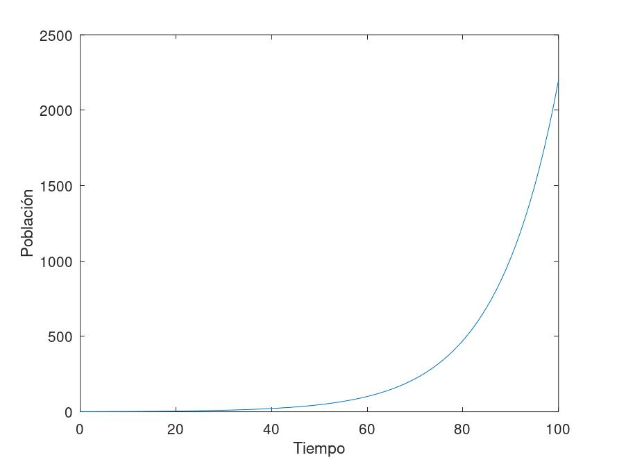

Para d(t) = a\*P(t), a > 0 la ecuación de la población resulta en  P(k+1) = P(k) + b\*P(k) - a\*P(k)\*P(k). Para este caso, se puede observar que la curva se aproxima a un valor de estabilización.

Simulación del modelo modificado, con b = 0.1, d = 0.02 y P(0) = 1

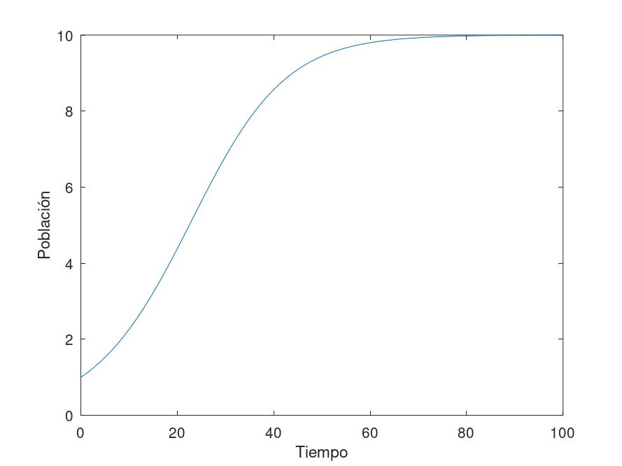

Para definir los puntos fijos, partimos de la definición para determinar el estado tal que P(t+1) = P(t)

```
P(t) + b*P(t) - a*P(t)*P(t) = P(t)
b*P(t) - a*P(t)*P(t) = 0
b*P(t) = a*P(t)*P(t)
b = a*P(t)
```

Resultan entonces **P = 0** y **P = b/a** los puntos fijos.

---

## Problema 2

Simulación con la primera implementación.

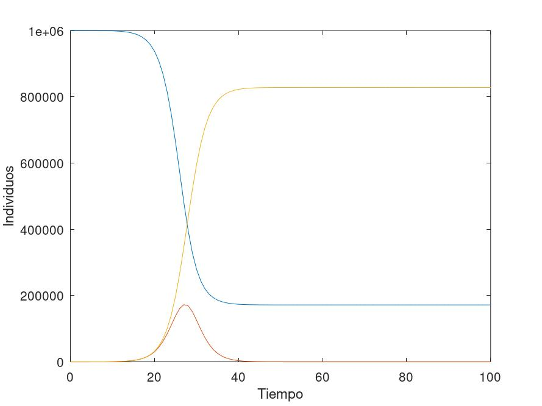

Simulación con la implementación que separa modelo de rutina de simulación.


Aún teniendo una cantidad muy baja de infectados iniciales (10), arriba del 80% de la población resultó infectada. Es interesante notar que la curva de infectados (curva roja) disminuye cuando la de individuos susceptibles (curva azul) es superada por la de los recuperados (curva amarilla). Esto tiene sentido, ya que la mitad de la población no sería infectable y en consecuencia habría cierta dificultad a la hora de contagiar nuevos individuos.

---

## Problema 3

Para esta simulación se obtiene un resultado muy parecido al anterior respecto a la forma de las curvas y los valores finales de susceptibles y recuperados. Sin embargo, se puede observar que dichas curvas ocupan todo el eje x propuesto en la imagen, esto es, que el tiempo de simulación necesario para analizarlas es aproximadamente el doble respecto a la simulación anterior. Esto se debe a que la población expuesta demora la propagación de la infección en la población. También esto resulta en un pico de infectados menor.

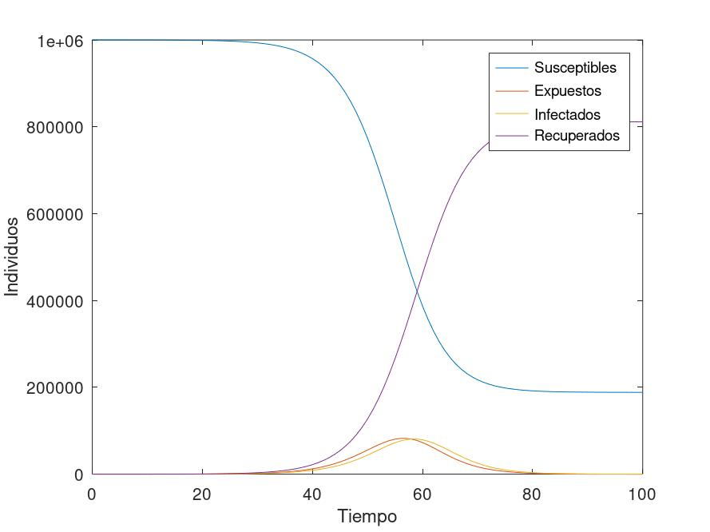


---

## Problema 4

```matlab
function x=discreteSEIR2(pre_x,t)
    N=1e6;
    pre_S=pre_x(1);
    pre_E=pre_x(2);
    pre_I=pre_x(3);
    pre_R=pre_x(4);
    pre_NE = pre_x(5:length(pre_x))

    TR=length(pre_x)-4
    TI=3
    R0=1.5

    NEaux=R0/(TR-TI)*pre_S*pre_I/N

    S = pre_S-NEaux
    E = pre_E+NEaux-pre_NE(TI)
    I = pre_I+pre_NE(TI)-pre_NE(TR)
    R = pre_R+pre_NE(TR)

    NE=[NEaux;pre_NE(1:TR-1)]

    x=[S;E;I;R;NE];
endfunction
```

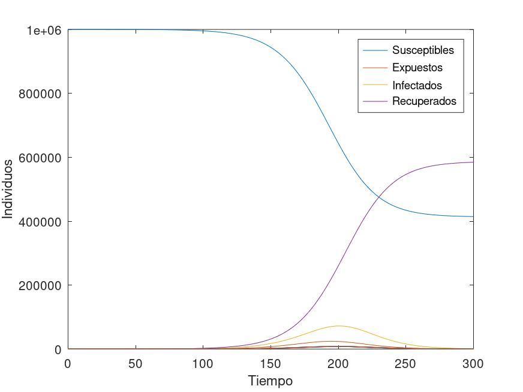

La simulación de este modelo muestra una curva de infectados mucho más aplanada, un incremento mucho menor respecto a la simulación anterior, debido a que el retardo de los períodos de incubación retrasa el ritmo de infecciones en la población.

---

## Problema 5

La transcripción de los modelos a OpenModelica fue bastante directa. Las gráficas muestran que las simulaciones realizadas (bajo las mismas condiciones iniciales anteriores) dan los mismos resultados.

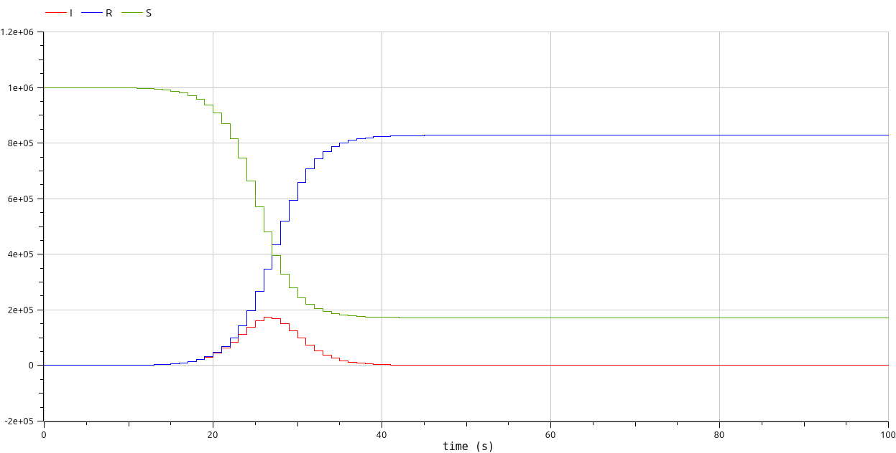


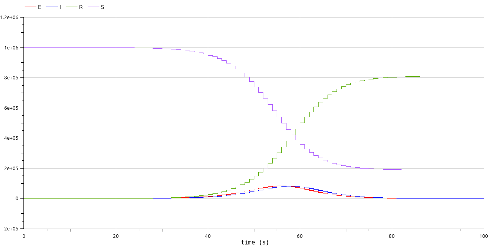


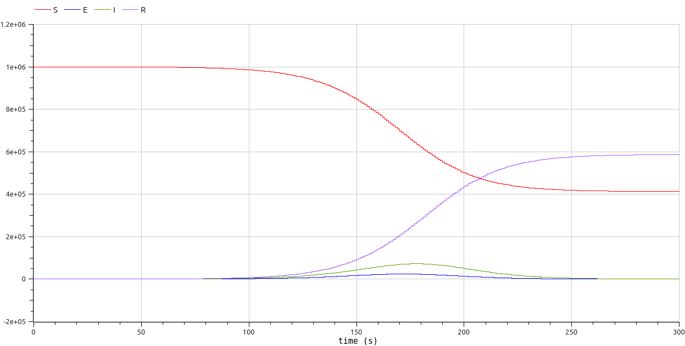

---

## Problema 6

En la simulación con dos poblaciones, el pico de infectados mayor se da en la población que arrancó sin ellos. Se podría asumir que esta diferencia se da debido a que los casos importados afectan directamente al crecimiento de casos de infecciones en general.

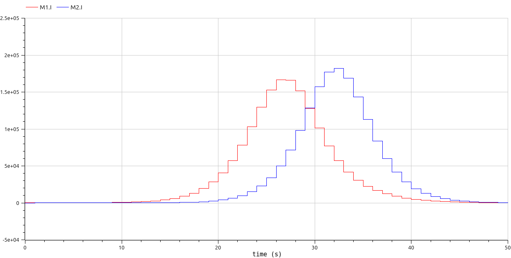

Para la simulación con tres poblaciones se repite este comportamiento entre la primera y la segunda población, pero no entre la segunda y la tercera. Esto puede ocurrir debido a que la cantidad de casos importados en la tercera población es la mitad de los exportados de la segunda. 

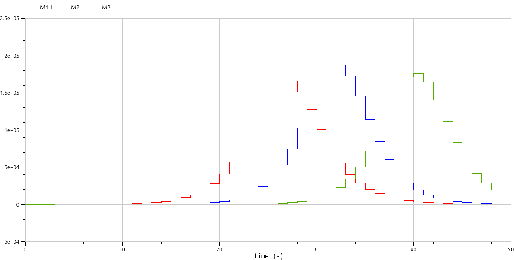

---

## Problema 10

En la primera simulación, el robot se mueve de forma circular sobre el plano descripto en el enunciado. Notar que los valores que definen los ángulos de interés nunca tienden a 0.

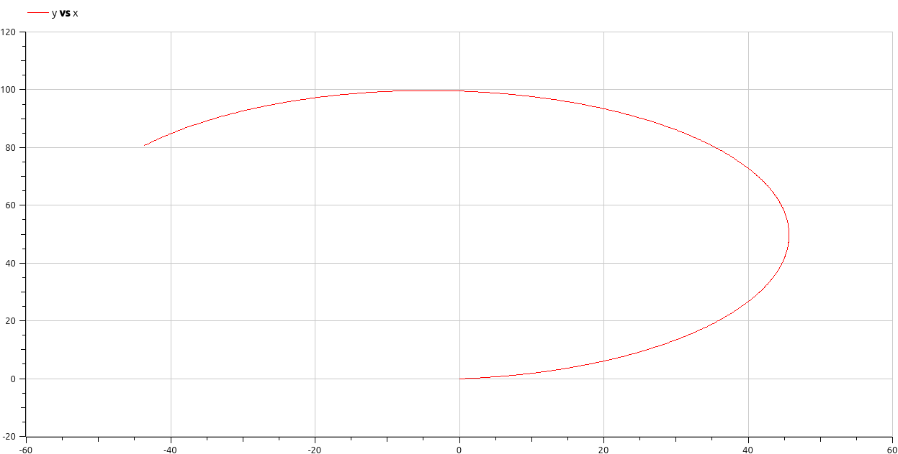
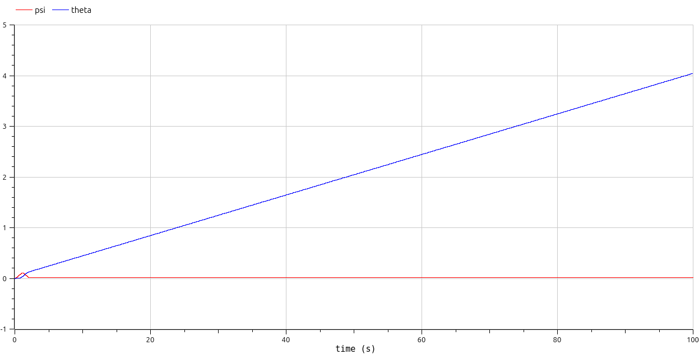

Para la segunda simulación, el robot al principio mueve un poco las ruedas hasta dejarlas en su estado natural. El segundo gráfico muestra que sus ángulos tienden a 0.

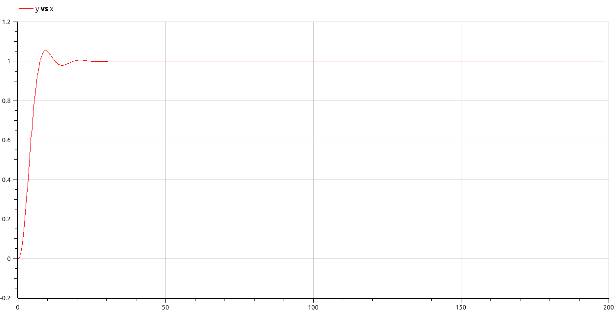
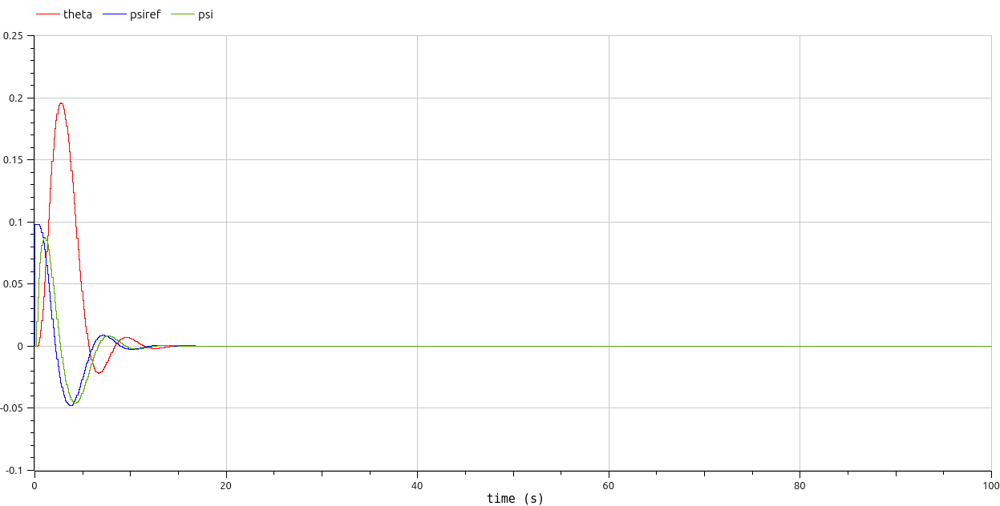

---
