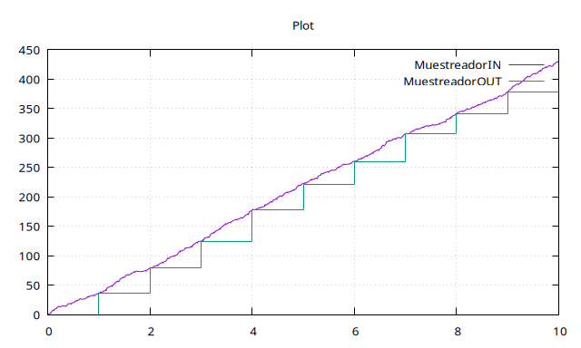

# Entrega Práctica 2 

## Francisco Elías. E-1217/3
## Sebastián Morales. M-6501/3 
---

## Problema 1. Fuente.

Para este modelo no se necesita definir un conjunto de valores de entrada ni una función de transición externa, ya que solamente emite los trabajos. Por esto, el estado solo necesita saber cuál es el tiempo de avance, el cual se determina de forma aleatoria en cada transición interna.

```
X = {}
Y = R+
S = R+
delta_int(s) = random(0, Tmax)
lambda(s) = random(Jmin, Jmax)
ta(sigma) = sigma 
```

donde random(x,y) es un valor tomado al azar con una distribución uniforme en el intervalo \[x,y\].

---

## Problema 2. Procesador.

El estado contiene dos valores: el tiempo de avance, que representa el tiempo de procesamiento del último trabajo recibido (o infinito en caso de estar libre este último); un valor que indica si se encuentra trabajando/procesando actualmente. Se define la función de transición externa, que acepta un trabajo y toma su valor como tiempo de avance en caso de estar libre, mientras que lo descarta y reduce su tiempo de avance en caso contrario. El estado inicial del componente es pasivo, esperando la llegada del primer trabajo.


```
X = R+
Y = {1}
S = R+ x {true, false}
delta_ext((sigma, busy), e, x) = (sigma-e, true) si busy = true
delta_ext((sigma, busy), e, x) = (x, true) si busy = false
delta_int(s) = (inf, false)
lambda(s) = 1
ta(sigma, busy) = sigma
```

La siguiente simulación muestra una secuencia de valores emitidos por la fuente y las señales del procesador. Puede apreciarse que se ignoran varios trabajos.


---

## Ejercicio 3. Cola.

Además del tiempo de avance, el estado de la cola se compone por una lista de reales (los trabajos encolados) y el estado de trabajo del procesador. La transición externa decide dos cosas, dependiendo del puerto en el cual reciba señales: encolar el trabajo recibido si este viene de la fuente y verificar si necesita comunicarse con el procesador; enviar el próximo trabajo (si existe) al procesador si proviene una señal del mismo. La transición interna oscila entre estados transitorios y pasivos dependiendo del mensaje que deba emitir al procesador. El estado inicial es pasivo, con la cola vacía y un indicador de procesador libre.


```
X = (R+ x {0}) U {(1,1)}
Y = R+
S = R+ x {0, inf} x {true, false}
delta_ext((q,sigma, busy), e, (v,port)) = (<v> ++ q, sigma, busy) si port = 0 y busy = true
delta_ext((q,sigma, busy), e, (v,port)) = (<v> ++ q, 0, busy) si port = 0 y busy = false 
delta_ext((q,sigma, busy), e, (v,port)) = (q, sigma, false) si port = 1 y q = <> 
delta_ext((q,sigma, busy), e, (v,port)) = (q, 0, false) si port = 1 y q != <> 
delta_int(<v> ++ q, sigma, busy) = (q, inf, true)
lambda(<v> ++ q, sigma, busy) = v 
ta(q, sigma, busy) = sigma 
```

Este gráfico muestra las emisiones de la fuente, la señal del procesador que notifica que está trabajando y el trabajo emitido por la cola hacia dicho procesador. Notar que la señal del procesador y el trabajo de la cola coinciden en el eje x y que la frecuencia de emisión de trabajos por parte de la fuente es mucho mayor que el trabajo adquirido por el procesador. Esto será relevante en los puntos siguientes.


---

## Ejercicio 4. Sensor.

El sensor necesita almacenar en su estado el contador de trabajos acumulados y el tiempo de vida del estado. Como emite eventos solamente cuando el valor del contador es modificado, se mantiene en un estado pasivo hasta recibir algún evento de entrada, donde pasará a uno transitorio para emitir el valor del contador antes de volver a esperar. Su estado inicial es un estado pasivo con un contador en cero.

```
X = (R+ x {0}) U (R+ x {1})
Y = Nat
S = {0, inf} x Nat
delta_ext((sigma, n), e, (v, port)) = (0, n+1) si port = 0
delta_ext((sigma, n), e, (v, port)) = (0, n-1) si port = 1
delta_int(sigma, n) = (inf, n)
lambda(sigma, n) = n
ta(sigma, n) = sigma
```

Este gráfico muestra cómo evoluciona el contador del sensor. 


---

## Ejercicio 5. Filtro. 

El filtro necesita preservar la probabilidad de aceptación de los trabajos, el último trabajo recibido y el tiempo de vida. En caso de recibir una probabilidad nueva, actualiza su valor interno. En caso de que sea un trabajo, decide si aceptarlo o no (en base a la probabilidad descripta) y emite su señal en el puerto correspondiente. Por fuera de eso, queda a la espera de eventos en un estado pasivo.

```
X = (R+ x {0}) U ([0,1] x {1})
Y = (R+ x {0}) U (R+ x {1})
S = R+ x {0, inf} x [0,1]
delta_ext((job, sigma, p), e, (v, port)) = (v, 0, p) si port = 0
delta_ext((job, sigma, p), e, (v, port)) = (job, sigma, v) si port = 1
delta_int(job, sigma, p) = (job, inf, p) 
lambda(job, sigma, p) = (job, 0) si rand < p 
lambda(job, sigma, p) = (job, 1) si rand >= p 
ta(job, sigma, p) = sigma
```

donde rand = random(0,1)

Este gráfico muestra la salida de los dos puertos del filtro, con una probabilidad constante igual a 0.5.


Y acá se puede apreciar que el contador del sensor es menor al obtenido en el ejercicio anterior debido a que el filtro, valga la redundancia, filtra la mitad de los trabajos.


---

## Ejercicio 6. Muestreador.

El muestreador necesita almacenar el valor a emitir y el tiempo de vida. Este modelo, a diferencia de los anteriores, inicia emitiendo su valor inicial y en cada transición interna vuelve a un estado con tiempo de vida igual a T. Las señales recibidas actualizan el valor interno y reducen su tiempo de vida para preservar la frecuencia de emisión constante de T unidades.

```
X = R+
Y = R+
S = R+ x ({0} U R+) 
delta_ext((last, sigma), e, v) = (v, sigma-e)
delta_int(last, sigma) = (last, T)
lambda(last, sigma) = last
ta(last, sigma) = sigma
```

En el siguiente par de gráficos se muestran las señales de entrada y salida del muestreador y cómo las segundas transmiten periódicamente el último valor recibido por parte del sensor.




---

## Ejercicio 7. Controlador.

El modelo para el controlador fue implementado como un sistema acoplado de tiempo discreto usando elementos de las librerías de PowerDevs. Este recibe el largo actual de la cola de procesamiento en cada instante de tiempo de parte del muestreador y emite la probabilidad de aceptación para intentar mantener el valor de la cola lo más cerca posible a un valor deseado l_ref.

---

## Ejercicio 8. Sistema completo.

A continuación se muestran los resultados de varias simulaciones del sistema completo, modificando algunos parámetros para analizar los distintos comportamientos del mismo.

Para el primer caso, se muestra el sistema simulado con los parámetros descriptos en el enunciado. Durante los primeros instantes la cola se llena abruptamente, luego llega a vaciarse por completo y finalmente mantiene un comportamiento constante en el cual su capacidad cubierta oscila en un rango de valores cercanos a l_ref (en este caso, 50). Todo esto se puede complementar con el gráfico de las distintas probabilidades calculadas: al principio es igual a 1, luego es igual a 0 y finalmente oscila entre 0 y 0.4.


Para el segundo caso, se modificó Tmax a 0.05 para simular mayor demanda de trabajo. En comparación al caso anterior, pareciera que la capacidad de la cola oscila en un rango mayor de valores. A su vez, los picos de probabilidad obtenidos son más altos. 


Para el tercer caso, modificar l_ref no trajo cambios significativos, por lo cual se optó por evaluar el controlador que calcula las probabilidades. Aumentar K1 a 0.1 hizo que el controlador sea más susceptible a la distancia entre los largos deseado y actual de la cola, haciendo que la probabilidad oscile casi siempre entre 0 y 1 en cada instante de tiempo. Esto resulta en longitudes inestables de la cola.


Aumentando K2 se ha obtenido un comportamiento análogo. 

---

## Ejercicio 9. Procesamiento en paralelo.

Se agregó un par de modelos cola-procesador conectados al puerto de trabajos descartados del filtro (puerto 1) para simular procesamiento en paralelo.
