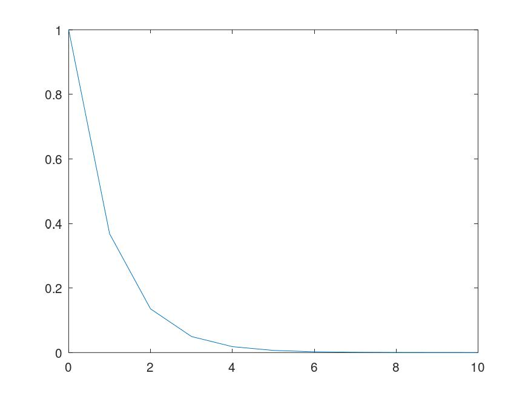
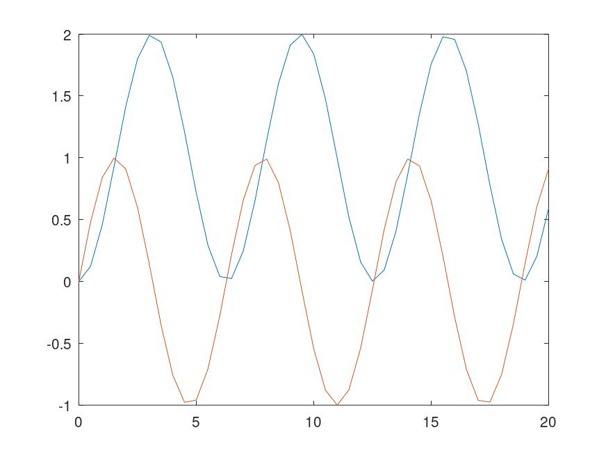
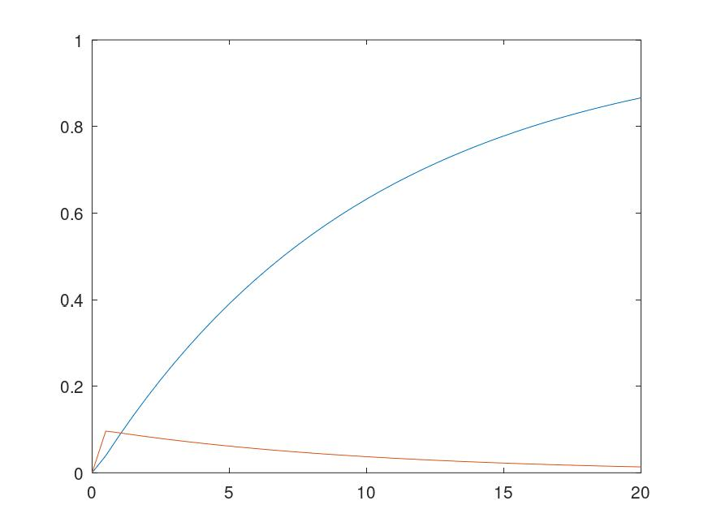
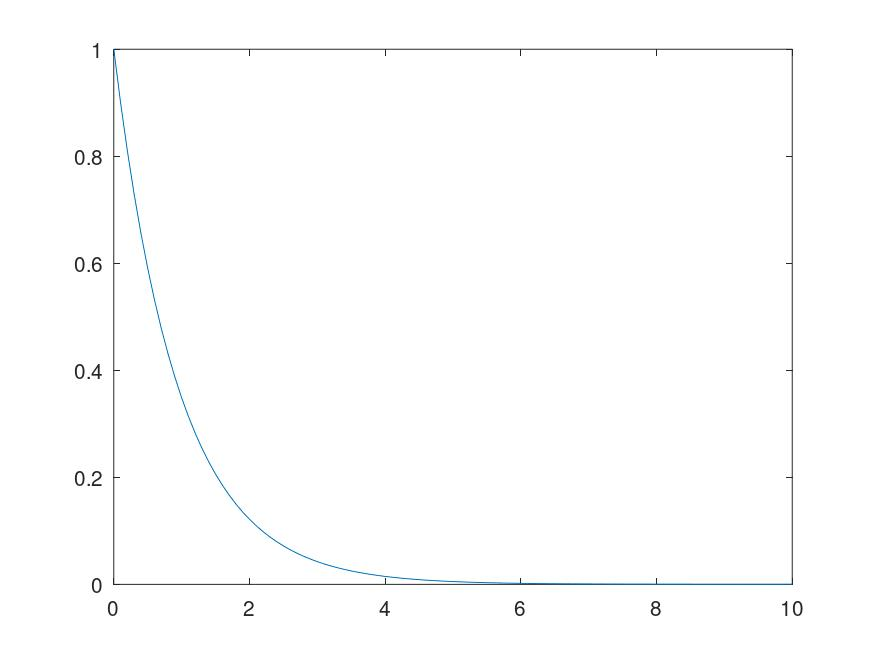
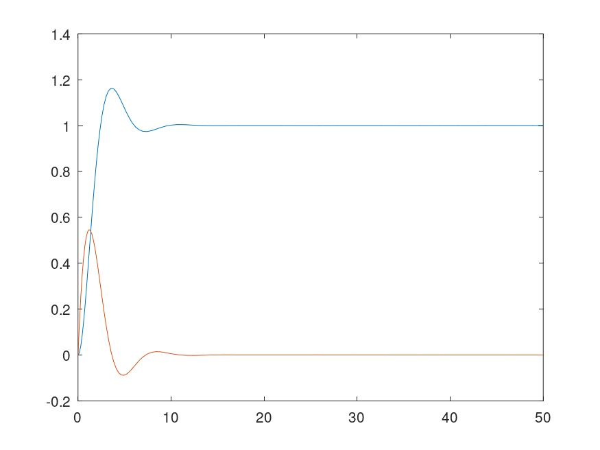
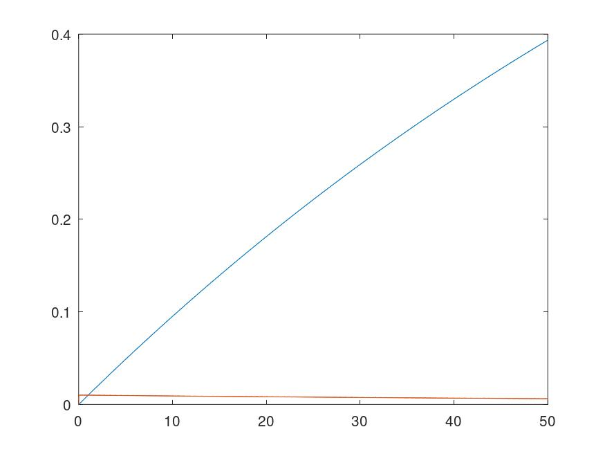
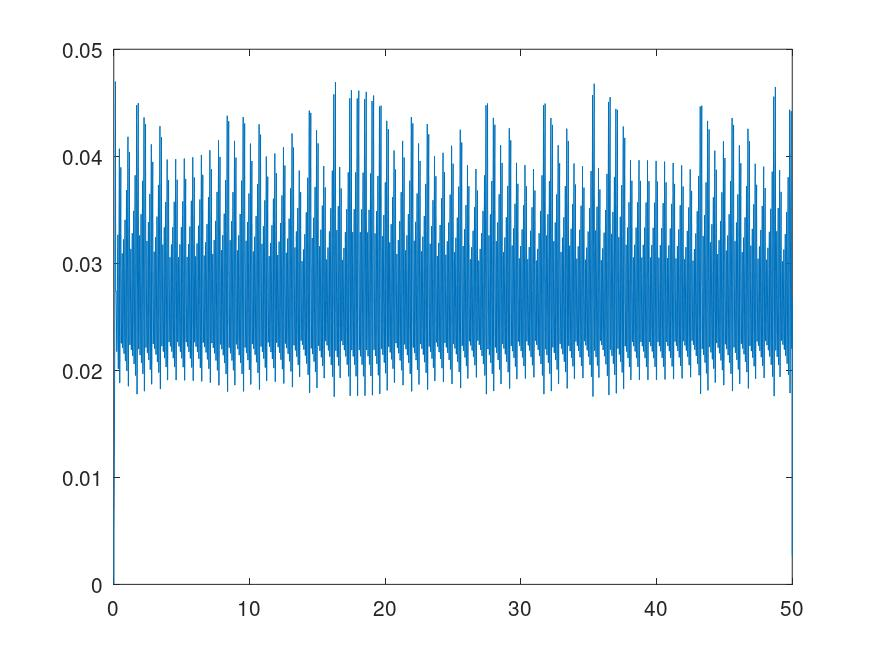
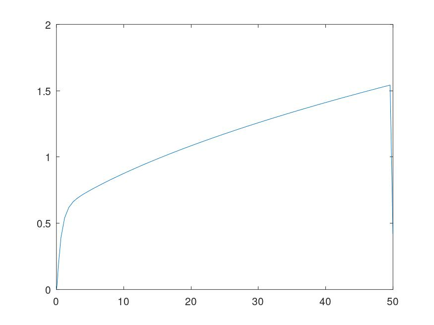
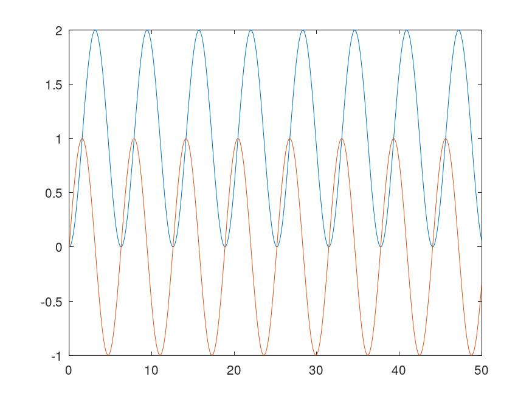

# Entrega Práctica 3

## Francisco Elías. E-1217/3
## Sebastián Morales. M-6501/3 
---

## Problema 1

Al expresar el problema en la forma `x'(t) = A*x(t) + B*u` se tiene que la matriz A es el escalar `-a`, mientras que `B*u = 0` dado que no hay entradas. Por lo tanto, la solución analítica estará dada por:

```
dx/dt = -a*x(t)
dx/x(t) = -a*dt
int(dx/x(t)) = int(-a*dt)
logn(abs(x(t))) = -a*t + C
abs(x) = e^(-a*t + C) = e^C * e^(-a*t)

Sea k = e^C

abs(x(t)) = e^(-a*t)*k
=><exponencial positivo>=>
x(t) = k*e^(-a*t)

x(0) = k*e^(-a*0) = x0
     = k*e^0 = k = x0
```

Donde int(x) es integral de x, logn(x) es el logaritmo natural de x y abs(x) el valor absoluto de x.

En la figura puede apreciarse que la implementación de la solución analítica en Octave resulta en la curvatura exponencial esperada.



---

## Problema 2

La implementación de ltiSolve emplea la ecuación 2b en cada valor del arreglo de tiempo eficientemente, haciendo uso del método `expm` para calcular la exponencial matricial necesaria.


---

## Problema 3

De las ecuaciones de estado pueden obtenerse los siguientes valores para la solución analítica.

```
A = [0 1; -k/m -b/m]
B = [0; F/m]
u = 1
``` 

El valor inicial x0 será `[0; 0]`.

Con b = 1:


Con b = 0 oscila indefinidamente debido a que el rozamiento es nulo.




Con b = 10 resulta en un movimiento muy lento debido a la elevada fricción con el suelo.



---

## Problema 4.

Los resultados de las simulaciones hechas con la implementación de Forward Euler tienen una evolución muy similar a las soluciones analíticas vistas anteriormente.

Problema del fármaco.



Problema del resorte.


---

## Problema 5.

Debajo se encuentran los errores obtenidos para las simulaciones con las dos longitudes de paso solicitadas. A partir de los resultados se podría afirmar que Forward Euler es un algoritmo de primer orden, ya que al disminuir 10 veces la longitud de paso se obtiene un error de primer paso 10^2 veces menor, pero un error máximo 10 veces menor.

| Paso (h)  | Error primer paso  | Error máximo  |
|---|---|---|
| 0.1  | 9.8293e-03  | 0.066139  |
| 0.01  | 9.9833e-05  | 6.1432e-03  |

---

## Problema 6.

Los resultados experimentales para cada coeficiente de roce b fueron los siguientes:
- b = 1: simulación marginalmente estable con un paso h = 1. Con valores menores es estable, mientras que con valores mayores se vuelve inestable.
- b = 0: los resultados fueron inestables para todas las longitudes de paso empleadas.
- b = 10: con h = 0.1 los valores se estabilizan. Con un h mayor resultan inestables. 

Para el análisis con autovalores, se hace uso de la función `eig`.

```
- b = 1
A = [0 1; -1 -1]
octave:22> abs(1 + 1 * eig(A))
ans =
   1.0000
   1.0000

- b = 10
A = [0 1; -1 -10]
octave:22> abs(1 + 0.2 * eig(A))
ans =
   0.9798
   0.9798

- b = 0
A = [0 1; -1 0]
octave:41> abs(1 + 0.00001 * eig(A))
ans =
   1.0000
   1.0000
```

Los resultados obtenidos por prueba y error se acercan bastante a los teóricos máximos, en donde la diferencia fundamental se observa en b = 10, en donde el h máximo es un poco más de 0.2, a diferencia del 0.1 obtenido.
En el caso de b = 0, aun reduciendo h a valores ínfimos los autovalores de Ad son 1, coincidiendo con lo observado.

---

## Problema 7.

Para Backward Euler, si bien los errores obtenidos fueron menores que con Forward, no hay una mejora sustancial.

| Paso (h)  | Error primer paso  | Error máximo  |
|---|---|---|
| 0.1  | 9.0896e-03  | 0.056461  |
| 0.01  | 9.9157e-05  | 6.0471e-03  |

Para el análisis teórico de este método vamos a analizar los autovalores de A en cada caso para intentar dar una explicación a lo observado, dado que el método presenta estabilidad casi en todos los casos.

- b = 1
Al variar el h, no llegamos a ningún valor el cual nos parezca que el resultado ya no era estable.

```
A = [0 1; -1 -1]
octave:2> eig(A)
ans =
  -0.5000 + 0.8660i
  -0.5000 - 0.8660i
```

Notemos que la parte real de los dos autovalores de A es menor a 0, por lo que el resultado es siempre estable, coincidiendo con lo observado de forma gráfica.

- b = 10
Al variar el h, no llegamos a ningún valor el cual nos parezca que el resultado ya no era estable.


```
A = [0 1; -1 -10]
octave:4> eig(A)
ans =
  -0.1010
  -9.8990
```

En este caso la parte real de los dos autovalores de A tambien es menor a 0, por lo que el resultado es siempre estable, coincidiendo con lo observado de forma gráfica.

- b = 0
Variando h no encontramos un valor el cual muestre un resultado estable.

```
A = [0 1; -1 0]
octave:6> eig(A)
ans =
   0 + 1i
   0 - 1i
```

La parte real de los autovalores es 0, por lo que el resultado va a ser siempre inestable independientemente de h, como lo observado.

---

## Problema 8.

Para Heun sí se nota una mejora sustancial en la precisión respecto a los dos métodos de Euler anteriormente vistos. Se comprueba que es un método de segundo orden, ya que el error del primer paso disminuye tres órdenes de magnitud y el máximo en dos órdenes al disminuir diez veces la longitud de paso h.


| Paso (h)  | Error primer paso  | Error máximo  |
|---|---|---|
| 0.1  | 1.7067e-04  | 2.4063e-03  |
| 0.01  | 1.6708e-07  | 2.3020e-05  |

- b = 1
Observamos que h puede estar oscilando entre 1.4 y 1.5.

```
A = [0 1; -1 -1]
octave:61> abs(eig( eye(2,2)+2*A+0.5*(2*A)^2  ))
ans =
   1
   1
```

Sin embargo, el analisis teórico nos permite estirar un poco más, hasta un paso de 2.

- b = 10
Estimamos que el valor máximo de h es 0.1 en este caso.

```
A = [0 1; -1 -10]
octave:80> abs(eig( eye(2,2)+0.202*A+0.5*(0.202*A)^2  ))
ans =

   0.9798
   0.9996
```

De forma teórica se puede ver que es válido el resultado, pero que se puede estirar un poco más, hacia 0.202.

- b = 0
Según lo observado, el valor máximo de h está entre 0.1 y 0.2.

```
A = [0 1; -1 0]
octave:89> abs(eig( eye(2,2)+0.1*A+0.5*(0.1*A)^2  ))
ans =
   1.0000
   1.0000
```

Según el resultado teórico, el valor máximo es 0.1.

---

## Problema 9.

Los errores obtenidos con la regla trapezoidal son de los mismos órdenes de magnitud que los obtenidos con Heun, lo cual es esperable para otro método de segundo orden. 

| Paso (h)  | Error primer paso  | Error máximo  |
|---|---|---|
| 0.1  | 9.0615e-05  | 1.1439e-03  |
| 0.01  | 8.4156e-08  | 1.1451e-05  |

La regla trapezoidal mantiene la estabilidad en estos ya que su solucion analitica es estable.

- b = 1

En este caso, vimos que h podía tener un valor máximo de 2.

```
A = [0 1; -1 -1]
octave:29> abs(eig( inv(eye(2,2)-0.5*2*A)*(eye(2,2)+0.5*2*A)  ))
ans =
   0.5774
   0.5774
```

Sin embargo, el analisis nos dice que se pueden usar valores mucho mayores de h.

- b = 10

Variando h, no encontramos un valor máximo por el cual el resultado no sea estable.

```
A = [0 1; -1 -10]
octave:34> abs(eig( inv(eye(2,2)-0.5*2123*A)*(eye(2,2)+0.5*2123*A)  ))
ans =
   0.9815
   0.9998
```

Efectivamente, el análisis muestra el mismo comportamiento.

- b = 0

Según lo observado, el valor máximo de h está entre 0.1 y 0.2.

```
A = [0 1; -1 0]
```

Para este caso, el sistema es marginalmente estable. La regla trapezoidal es un método F-Estable que también preserva dicha característica, por lo que al analizar los autovalores de Ad siempre van a ser iguales a 1 en valor absoluto.

---

## Problema 10.

Como se vio previamente, el método de Heun se vuelve inestable con longitudes de paso h altas en el sistema masa-resorte con coeficiente de roce b = 1. Es esperable entonces el resultado obtenido, en donde el paso h oscila entre 2 y 4, ya que no puede agrandar más su valor mientras mantiene el error dentro de los valores admitidos.




Para b = 100, solo puede mantenerse la estabilidad con valores de paso h muy pequeños, donde estos oscilan entre 0.02 y 0.04.




---

## Problema 11.

A diferencia del problema anterior, el usar un método implícito permite preservar la estabilidad numérica del sistema original. En consecuencia, las simulaciones con coeficientes de roce b = 1 y b = 100 no tienen inconvenientes de errores grandes y pueden utilizar longitudes de paso considerablemente mayores a los logrados por RK23.




El caso del coeficiente de roce b = 0 es particular, ya que al preservar la estabilidad marginal es necesario usar un tamaño de paso pequeño debido a la frecuencia de oscilación de las variables de estado. Como los valores se modifican con frecuencia, no puede emplearse una longitud de paso h significativa respecto a la frecuencia de las curvas, porque probablemente se tenga un error alto si se las deforma.



